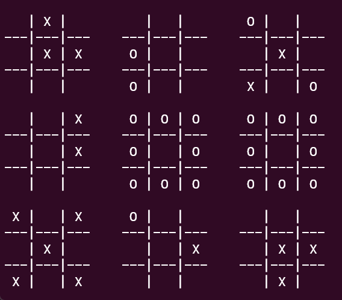
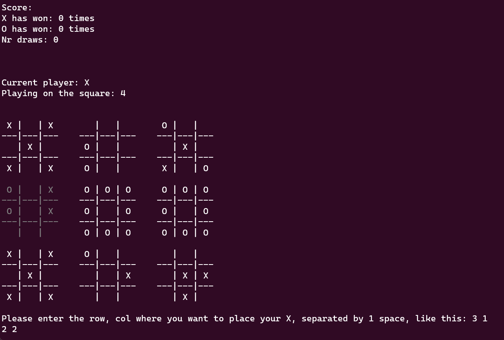

<div align = "center">
<pre>
 ___  ___  ___   _________  ___  _____ ______   ________  _________  _______      
|\  \|\  \|\  \ |\___   ___\\  \|\   _ \  _   \|\   __  \|\___   ___\\  ___ \     
\ \  \\\  \ \  \\|___ \  \_\ \  \ \  \\\__\ \  \ \  \|\  \|___ \  \_\ \   __/|    
 \ \  \\\  \ \  \    \ \  \ \ \  \ \  \\|__| \  \ \   __  \   \ \  \ \ \  \_|/__  
  \ \  \\\  \ \  \____\ \  \ \ \  \ \  \    \ \  \ \  \ \  \   \ \  \ \ \  \_|\ \ 
   \ \_______\ \_______\ \__\ \ \__\ \__\    \ \__\ \__\ \__\   \ \__\ \ \_______\
    \|_______|\|_______|\|__|  \|__|\|__|     \|__|\|__|\|__|    \|__|  \|_______|
 _________  ___  ________          _________  ________  ________          _________  ________  _______      
|\___   ___\\  \|\   ____\        |\___   ___\\   __  \|\   ____\        |\___   ___\\   __  \|\  ___ \     
\|___ \  \_\ \  \ \  \___|        \|___ \  \_\ \  \|\  \ \  \___|        \|___ \  \_\ \  \|\  \ \   __/|    
     \ \  \ \ \  \ \  \                \ \  \ \ \   __  \ \  \                \ \  \ \ \  \\\  \ \  \_|/__  
      \ \  \ \ \  \ \  \____            \ \  \ \ \  \ \  \ \  \____            \ \  \ \ \  \\\  \ \  \_|\ \ 
       \ \__\ \ \__\ \_______\           \ \__\ \ \__\ \__\ \_______\           \ \__\ \ \_______\ \_______\
        \|__|  \|__|\|_______|            \|__|  \|__|\|__|\|_______|            \|__|  \|_______|\|_______|
</pre>
<div align = "right">

By [Teodor Neagoe](https://github.com/Teoneag) & [Horia Galitianu](https://github.com/horiagali)
</div>

</div>

## 0. Prolog :))
Remember those days when Tic Tac Toe felt a tad too small? Introducing the solution: Ultimate Tic Tac Toe! Now, instead of just 9 squares, you've got... 9 squares. But wait for it, each of those squares is made up of another 9 squares! That's right, it's not just 9 times the fun, it's 81 times the confusion! Tic Tac Toe, now in Super Mega Ultra HD.

## 1. Using example

### a) OS
The game is targeted for Linux (Ubuntu).
- It can be run on Windows using WSL (Windows Subsystem for Linux) - [click here for official instalation guide](https://learn.microsoft.com/en-us/windows/wsl/install).

### b) Terminal
Open the Ubuntu terminal.
* If you use WSL, for the blinking animation to work, we reccomand the Windows terminal application, so run the ubuntu terminal from there using the following command:
```sh
ubuntu
```
* If the folder is on windows, you can use the following command:
```sh
cd /mnt/path/to/folder
```

### c) Compiling
As the compiled file is system specific, you need to complile it yourself. For this you need gcc. If you don't have it, install it by running the following command from the ubuntu terminal, as administrator, or using sudo:
```sh
apt update && apt upgrade -y && apt install build-essential gdb -y
```
Open the ubuntu terminal in the folder where you saved the game, or clone it from Github (for this you need [Git](https://git-scm.com/) installed) using the following command:
```sh
git clone https://github.com/Teoneag/Ultimate_Tic_Tac_Toe_asm.git
```
Compile it using the following commnad:
```sh
make
```
Which internally runs this command:
```sh
gcc -no-pie -o Ultimate_Tic_Tac_Toe_Assembly Ultimate_Tic_Tac_Toe_Assembly.s
```

### d) Running
Run the following command:
```sh
make run
```
Which internally runs this command:
```sh
gcc -no-pie -o Ultimate_Tic_Tac_Toe_Assembly Ultimate_Tic_Tac_Toe_Assembly.s
```

### e) Read the rules

### f) Enjoy!

## 2. Rules
- Players: The game is played by two players, X and O, taking alternate turns.
- Initial Move: Player X begins by placing a symbol anywhere on the 9x9 grid.
- Relative Moves: The opponent (Player O) is then compelled to play within the corresponding 3x3 grid. The location of Player X's move dictates the smaller grid where Player O must play.
- Winning a Grid: If a move in a smaller grid results in a win by traditional Tic-Tac-Toe rules (three in a row, vertically, horizontally, or diagonally), the entire smaller grid is awarded to the player in the larger 9x9 grid. Subsequent moves cannot be made within a fully won or fully occupied smaller grid.
- Alternative Play: If a player is directed to a smaller grid that is already won or completely occupied, they have the liberty to choose any available smaller grid for their next move.
- Game Conclusion: The game concludes when a player wins the larger 9x9 grid by securing three smaller grids in a row (vertically, horizontally, or diagonally), or when no further legal moves are available, resulting in a draw.

## 3. Snapshots


## 4. Testing

### a. Win X
This input should win the game for X:
2 2
1 1
2 2
1 2
2 2
1 3
2 1
1 1
2 1
1 2
2 1
1 3
2 3
3 1
2 3
3 2
2 3
3 3

### b. Win O
This input should win the game for O:
1 1
2 2
3 3
2 2
3 2
2 2
3 1
2 1
1 1
2 1
1 2
2 1
1 3
2 3
3 1
2 3
3 2
2 3
3 3

### c. Draw
This input should end in a draw:
2 2
2 2
1 1
2 2
2 1
2 2
1 3
2 2
2 3
2 2
3 2
1 1
3 3
3 3
2 2
1 2
2 2
3 1
2 2
3 3
1 1
1 1
1 2
3 3
1 2
1 1
2 1
1 1
1 3
1 1
3 2
2 2
3 2
3 3
1 3
3 3
3 2
1 3
1 2
2 1
3 3
1 3
1 3
1 1
2 3
1 3
3 1
1 1
1 2
1 3
1 3
3 1
3 3
3 1
2 3
3 1
1 2
2 3
1 1
2 3
1 2
2 3
2 1
3 2
3 1
3 2
2 3
2 3
3 1
2 1
3 1
2 3
1 3
1 3
3 3
2 1
3 2
3 3
2 1
1 3
2 3

## 5. Implementation
The game stores the following data

### General data
- Nr of wins X
- Nr of wins O
- Nr of draws

### Current game state
- currentPlayer: X or O
- matrix9 = the matrix of the “big” table: 3 x 3 (an array in memory)
    * \- for empty
    * D for draw on that square
    * X for X won that square
    * O for O won that square
- index9 = the index of the current square in the matrix9: 0 - 8
- matrix81 = a matrix for the smaller squares: 9 x 9 (an array in memory)
    * coords_to_index(x, y) = 9 * (x - 1) + y
- index81 = the index of the current square in the matrix81: 0 - 80
- currentInput = the current input: 0 - 8, 9 for chose any

### Current game display
- stringPrintTable = string for printing the table (table lines + content)

## 6. Done
- Teon
    * add_to_output_from_small_index
    * add_to_output_small_win
    * check_win
    * display_data
    * get_index_from_nr_x_y
    * get_input
    * reset_game
    * template_function
    * win_screen
    * main, make, readme

- Gali
    * add_to_output_from_big_index
    * clear_screen
    * get_index_from_nr_nr
    * print_matrix
    * print_win_message
    * small_to_big_index
    * welcome_screen

## 7. TODO
- Critical
    * fix bug get draw when it should be win (Ta + Andrei Ion)
    * add game rules
    * add better menu + end screen
    * be able to save game, close game, open game 
    * timer
- Teon
    * reset button
    * move ugly strings from main to file
    * shower
- Gali
    * Art
        - loading screen art - add it to github as well
    * get some b*itches

## 8. Bugs solved
- Rares bug: the print_matrix function was trashing the value in %r12, so when having a specific input, the program would crash

## 9. Learned
- .fill 81 1 '-' can get seg fault? - why????
- to write conventions before starting
- women don't like when you talk about programming!!!

## 10. Special thanks
- Rares Popa - tester
- Andrei Ion - tester
- TA that signed our project - tester
- Mete - tester
- Gali's mom - "zacusca" provider
